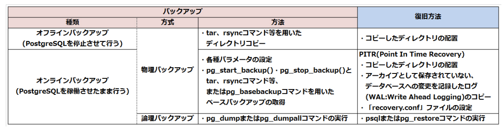

# Ping-T メモ

<br/>

## 一般知識
### PostgreSQLライセンス
- 商用目的でPostgreSQLのサポートを有償で提供することができる
- PostgreSQLの再配布は無償で行うことができる
- 商用、非商用に関わらず無償で使用することができる
- PostgreSQLは自由に複製でき、ソースコードの公開は必要ない

<br/>

### SQLの分類
|言語|コマンド|
|---|---|
|DDL|CREATE, ALTER, DROP, TRUNCATEなど|
|DML|SELECT, INSERT, UPDATE, DELETEなど|
|DCL|GRANT, REVOKE, BEGIN, COMMIT, ROLLBACKなど|

<br/>

### サポート期限
サポート期限は、メジャーバージョンの最初のリリースから5年間と決められている。

<br/>

### ライセンス
#### BSDライセンス
- 商用・非商用問わず誰でも無償で利用でき、自由に複製・改変できる。
- ソースコードを公開する義務はない。
- 再配布する際には、著作権とライセンス条文、無保証であることをドキュメントに記載する必要がある
- ソフトウェアの不具合に対して責任は負わない

<br/>


## 設定ファイル
### ログレベルの設定
|ログレベル|説明|
|---|---|
|INFO|ユーザから出力を要求された情報|
|NOTICE|ユーザにとって役立つ情報|
|WARNING|不適切なコマンド使用等に対するユーザへの警告|
|ERROR|特定のコマンドを中断させたエラー|
|LOG|データベース管理者にとって役立つ、パフォーマンスや内部の処理に関する情報|
|FATAL|特定のセッションを中断させたエラー|
|PANIC|全てのセッションを中断させた致命的なエラー|

<br/>


## 標準ツールの使い方
### pg_restartwal
WALや制御情報の破損によりPostgreSQLサーバが起動できない場合は、pg_restartwalコマンドを実行することで
復旧できる可能性がある。
コマンドの実行後はデータに不整合が発生している可能性がある。

|コマンド|説明|
|---|---|
|-d, --pgdata|対象となるデータベースクラスタを指定する|
|-n, --dry-run|実際に変更処理は行わず、変更内容の出力のみを行う|
|-f, --force|制御情報が読み取れない場合でも、強制的に実行する|

<br/>

### createuser
新しいユーザアカウントを定義する。

|オプション|説明|
|---|---|
|-P, --pwprompt|パスワードを設定する|
|-s, --superuser|新しいユーザをスーパーユーザとして作成する|
|-d, --createdb|データベースの作成を許可する|
|-r, --createrole|新しいユーザの作成を許可する|
|-l, --login|ログインを許可する|
|-S, --no-superuser|新しいユーザをスーパーユーザにしない|
|-D, --no-createdb|データベースの作成を禁止する|
|-R, --no-createrole|新しいユーザの作成を禁止する|
|-L, --no-login|ログインを禁止する|

OSのコマンドプロンプトから実行する場合: 
OSの管理ユーザー、一般ユーザーにかかわらず実行できるが、スーパーユーザ権限またはCREATEROLE権限が必要。

<br/>

### dropuser
アカウントを削除する。  
-Uを指定すると、接続時のデータベースユーザーを指定することができる。

<br/>

### createdb
- テンプレートデータベースから設定やオブジェクトをコピーして作成する。
- テンプレートにtemplate0を使用し、template0と別のエンコーディングを設定して新規にデータベースを作成できる。
- テンプレートデータベースを指定するオプションは、-Tまたは--templateである。
- スーパユーザと、CREATEDB権限があるユーザのみデータベースを作成できる
- スーパユーザであれば、CREATEDBコマンドの-Oオプションで、他ユーザをデータベースの所有者にできる

|オプション|説明|
|---|---|
|-E, --encoding=エンコーディング|データベース内で使用するエンコーディングを指定する|
|-O, --owner=ユーザ名|新しいデータベースの所有者となるユーザを指定する|
|-l, --locale=ロケール名|データベースで使用されるロケールを指定する|
|-T, --template=テンプレート名|テンプレートデータベースを指定する|

<br/>

### template
デフォルトではtemplate1が使用される。


|データベース名|説明|
|---|---|
|template0|テンプレートデータベース(変更不可)|
|template1|テンプレートデータベース(変更可)|
|postgres|通常のデータベースと同様に使うことができる|

<br/>

### pg_restore
論理バックアップのリストアに使用するコマンドで、テキスト以外(カスタム形式やtar形式)でバックアップされたファイルが対象となる。

|オプション|説明|
|---|---|
|-d, --dbname=データベース名|リストアを行う先のデータベース名を指定する。省略すると標準出力にテキスト形式のSQL分が出力される|
|-c, --clean|リストア前に既存のデータベースオブジェクトを削除する|
|-j, --jobs=ジョブ数|リストア処理を同時に実行するジョブ数を指定する|
|-1, --single-transaction|リストア処理を1つのトランザクションとして実行する|

```bash
$ pg_restore -d db002 db002.bak
# バイナリ形式のバックアップファイルをリストアする
```

<br/>

### psqlの接続オプション
|接続オプション|説明|環境変数|デフォルト|
|---|---|---|---|
|-U ユーザ名|接続時のデータベースユーザ名を指定|PGUSER|OSユーザ名|
|-h ホスト名またはIPアドレス|接続先のホスト名またはIPアドレスを指定|PGHOST|UNIXドメインによる接続|
|-d データベース名|接続先のデータベース名を指定|PGDATABASE|データベースユーザ名|
|-p ポート名|接続先のポート番号を指定|PGPORT|5432|

<br/>

### pg_ctl stop
|オプション|説明|
|---|---|
|-D データベースクラスタ名, --pgdata=データベースクラスタ名|対象となるデータベースクラスタを指定する。指定がない場合は、環境変数「$PGDATA」になる|
|-m シャットダウンモード|3つの異なるシャットダウン方式を指定する|
|-W|シャットダウンの完了を待たずにコマンド発行元に制御を戻す(デフォルトでは完了まで最大60秒待ち、停止完了のメッセージを表示する)|
|-t 最大待ち時間|シャットダウンが完了するまでの待ち時間を指定する 指定がない場合は60秒になる|

<br/>

## SQL
### Foreign key
下記のどちらでもOK.

```postgres
CREATE TABLE sample (
    no INTEGER REFERENCES sample_1 (id),
    name TEXT 
);
```

```postgres
CREATE TABLE sample (
    no INTEGER,
    name TEXT,
    FOREIGN KEY (no) REFERENCES sample_1 (id)
);
```

<br/>

### SQLの処理
下記のいずれも実行可能。
```bash
$ psql -c "SLECT * FROM sample"
testdb=> SELECT * FROM sample
$ psql testdb < sample.sql
$ psql -f 'sample.sql'
```

<br/>

### 配列型
配列型は複数の値を格納するデータ型であり、全データ型に対して使用できる。  
最初の要素のインデックスは`1`なので注意が必要。


### search_path

search_pathのデフォルトは、`$user, public`  
実行にスーパユーザ権限は必要ない。


### TRIGGER
挿入、更新、削除が要求された場合、各処理の前に一度だけ「log_write()」
関数を実行する。

```postgres
# CREATE TRIGGER sample_trg BEFORE INSERT OR UPDATE OR DELETE
  ON sample EXECUTE PROCEDURE log_write();
```

トリガー名を変更する
```postgres
# ALTER TRIGGER sample_trg ON sample RENAME TO log_trg;
```

トリガーを削除する
```postgres
# DROP TRIGGER sample_trg ON sample;
```


### NATURAL INNER JOIN
等しい名称のカラムを用いて、結合を行う。
```postgres
# SELECT * FROM member NATURAL INNER JOIN department;
```


### パーティショニング
テーブルなどのデータを複数のまとまりに分割する機能。
データへの処理パフォーマンスを向上させることができる。

パーティションの作成には、
```postgres
# CREATE TABLE PARTITION ...
```

パーティションの削除は、
```postgres
# DROP TABLE ...
```

### MATERIALIZED VIEW
複雑なSQL文のSELECT結果を頻繁に取得する場合に使用する機能。
データの実体を保持する。

定義を変更する場合は、`ALTER MATERIALIZED VIEW`  
ビューの更新は、`REFRESH MATERIALIZED VIEW`  

### sequence
シーケンスはデータの追加時に自動で連番を振ってくれる機能。
- マイナス値を生成することもできる。
- オプションで設定する増減値にはマイナス値の指定が可能。
- デフォルトは1
- 作成には、`CREATE SEQUENCE`
- 削除には、`DROP SEQUENCE`
- nextval()を呼び出す前にcurrval()を呼び出すとエラーになる

```postgres
-- シーケンスのセット  
# SELECT setval('sample', 100);
```


下記のコマンドでは、1010が返される。

```postgres
# CREATE SEQUENCE sample_sql CACHE 5 NO CYCLE;
# SELECT setval('sample_seq');
```

<br/>

### interval
現在の3ヶ月前の日時を取得する。
```postgres
# SELECT now() - interval '3 month';
# SELECT now() p '3 month'::interval;
```

<br/>

### FUNCTION
FUNCTIONの作成。  
STRICTオプションを指定すると、
NULLを渡すと処理を実行せずにNULLを返す。

```postgres
# CREATE FUNCTION sample_func(TEXT) RETURNS SETOF INTEGER AS $$
  SELECT id FROM sample staff = $1 ORDER BY id LIMIT 2;
  $$ LANGUAGE SQL STRICT;
```

FUNCTIONの削除。
```postgres
# DROP FUNCTION sample(TEXT);
```

<br/>

### CREATE PROCEDURE
version11から使用できる。  
CREATE FUNCTIONのうち、戻り値のないものに対して代用できる。

```postgres
# CREATE PROCEDURE funcX(VARCHAR) AS $$
  INSERT INTO suctomer_log VALUES($1, CURRENT_DATE, 'shopA');
  $$ LANGUAGE SQL;
```
PROCEDUREの呼び出しには、`CALL`を用いる。

<br/>

### バイナリ列データ
バイトの連続からなるテキスト以外のデータ。バイナリ列データを格納するデータ型として、BYTEA型が用意されている。

<br/>

### SCHEMA
多数のデータベースの格納先を、テーブルの目的や所有者に応じて分類する仕組みのこと。 実体としては、データベース内でテーブルなどのオブジェクトを格納している名前空間のことを指す。

- データベースクラスタの作成時にデフォルトでpublicスキーマが作成される。

```postgres
# CREATE SCHEMA test AUTHORIZATION user1;
```

SCHEMAの削除
```postgres
# DROP SCHEMA test;
```

SCHEMにオブジェクトが存在する場合、
```postgres
# DROP SCHEMA test CASCADE;
```

<br/>

### CURSOR
```postgres
# DECLARE sample_cursor INSENSITIVE CURSOR WITHOUT HOLD FOR SELECT * FROM sample;
```

`WITHOUT HOLD`は、トランザクション内でのみカーソルを使用するオプション(デフォルト).

FETCH  
- データの取得をせずにカーソルの移動のみを行う場合には`MOVE`コマンドを使用する。
- `PRIOR`オプションを指定すると、前の行のデータを取得する。
- `ALL`オプションを指定すると、カーソルのある次の行以降の全データを取得する。

逆方法にデータを取得しようとした場合はエラーとなり、トランザクションの実行中のみ有効である。
```postgres
# DECLARE sample_cursor NO SCROLL CURSOR FOR SELECT * FROM sample;
```
<br/>

### ドメイン
ユーザが一部の制約を設定して作成出来るデータ型のこと。  
複数のテーブルに対して、同じ制約条件(NULL/NOT NULL/CHECK)を持つデータ型を使用したい場合に、独自のデータ型を定義できる。

- ドメインにはデフォルト値を設定できる。
- データベースないの複数のテーブルに使用できる。
- ドメイン定義の変更は、`ALTER DOMAIN`を使用する。

<br/>

### 数値型

BIGINT  
64ビット(8バイト)

INT, INTEGER  
32ビット(4バイト)

DOUBLE PRECISION  
最低15桁の精度をもつ小数を格納する。

<br/>

### 宣言パーティション
- ハッシュ・パーティション
- レンジ・パーティション
- リスト・パーティション

<br/>

### PREPARED
性能を最適化するために利用可能なサーバ側オブジェクト。

プリペアド文の削除
```postgres
# DEALLOCATE sample_prepare;
```

<br/>

### テーブルスペース
- データベースオブジェクトの作成時に、格納するテーブルスペースを指定することができる
- データベースオブジェクトを各テーブルスペースに振り分けることで、性能を向上させることができる

<br/>

### INDEX
インデックスの削除
```postgres
# DROP INDEX member_idx;
```

<br/>

### DISTINCT
```postgres
# SELECT DISTINCT ON (groupNo) groupNo FROM sample WHERE sex = '男';
# SELECT DISTINCT groupNo FROM sample WHERE sex = '男';
```

<br/>

### \copy
- クライアント側のファイルにアクセスするpsqlのメタコマンド。  
- delimiterオプションを指定することで区切り文字を変更できる。
- スーパユーザ権限は必要ない

<br/>

### GRANT
GRANTコマンドで設定できる権限
- SELECT, COPY TO
- INSERT, COPY FROM
- UPDATE
- DELETE
- TRUNCATE
- REFERENCES
- TRIGGER
- CONNECT
- CREATE


- DROP権限は付与できない
- ANALYZE権限は付与できない
- CREATE ROLE/ CREATE USERは付与できない

```postgres
# GRANT INSERT ON sample TO PUBLIC;
-- 全ユーザがsampleテーブルにデータを挿入できる
```

<br/>


### ANALYZE
sampleテーブルに対する統計情報を収集する
```postgres
# ANALYZE sample;
```

<br/>

### VIEW
複雑なSQL文のSELECT結果を頻繁に使用したい場合、SELECT分の結果をテーブルのように定義することができる。

VIEWでは
- SELECT
- UPDATE
- DELETE
- INSERT
を実行できる。

ALTER VIEWでデフォルト値を設定する
```postgres
# ALTER VIEW sample_view ALTER groupNo SET DEFAULT 9;
```

- ALTER VIEWを実行するにはビューの所有者である必要がある。

<br/>

### ロック
PostgreSQLには、デッドロックを検知すると対象のトランザクションをロールバックし、自動で回復させる機能がある。
自動で回復させた場合、どのトランザクションがロールバックされるのかはわからない。

- デーブル全体のロックは、「LOCK TABLE テーブル名 IN ロックモード MODE」を使用して設定する
- 行に対するロックは、「SELECT FOR SHARE」や「SELECT FOR UPDATE」を使用して設定できる
- 行に対するロックは、排他ロックと共有ロックの2種類である

<br/>

## 設定ファイル
### initdb
|オプション|説明|
|---|---|
|-D ディレクトリ名、--pgdata=ディレクトリ名|データベースクラスタを作成するディレクトリを指定する。指定しない場合は、環境変数$PGDATAになる|
|-E エンコーディング, --encoding=エンコーディング|エンコーディングを指定する。指定しない場合は、OSのロケールから自動的に設定される|
|--locale=ロケール|ロケールを指定する。指定しない場合は、OSのロケールが使われる。--locale=Cはロケールを無効にする。|
|--no-locale|ロケールを無効にする。--locale=Cに同じ。|
|-U ユーザ名、--username=ユーザ名|作成するデータベースのスーパユーザ名を指定する。指定しない場合は、コマンドを実行したOSユーザ名でスーパユーザが作成される|
|-k, --data-checksums|データベースのチェックサム(データ破損を検出するための仕組み)を有効にする|
|-X ディレクトリ名、--waldir=ディレクトリ名|WALを格納するディレクトリを指定する|

<br/>

### postgresql.conf
PostgreSQLのパラメータを設定するファイル。  

- 全てのパラメータ名は大文字と小文字の区別がない
- パラメータは1行に1つずつ
- 設定変更反映のタイミングは、パラメータによって異なる

initdbで生成される。  

下記が重要な設定項目

- listen_addresses
- port
- max_connections
- search_path
- default_transaction_isolation
- client_encoding
- log_distination
- logging_collector
- log_directory
- log_filename
- log_min_messages
- log_line_prefix

<bt/>

#### 設定が反映されるタイミング

<br/>

### postgresql.auto.conf
- postgresql.confの設定よりも優先される
- バージョン9.4で追加された機能
- ALTER SYSTEMコマンドで操作する
<br/>

### pg_hba.conf
クライアント認証を設定するファイル。  
initdbで生成される。  

<br/>

### pg_settings
pg_settingsは、サーバのパラメータ値を取得するビュー。
nameカラムにパラメータ名、settingカラムにパラメータ値が表示される。

- internal: データベースクラスタの構築後は変更できない
- postmaster: PostgreSQLサーバの起動・再起動
- sighup: postgresql.confの再読み込み
- superuser-backend: スーパユーザで新しいセッションを開始
- backend: 一般ユーザで新しいセッションを開始
- superuser: スーパユーザでSETコマンド実行
- user: 一般ユーザでSETコマンド実行

<br/>

### ログメッセージ
- PANIC: 全てのセッションを中断させた致命的なエラー
- FATAL: 特定のセッションを中断させたエラーが発生
- ERROR: 特定のコマンドを中断させたエラーが発生
- WARNING: 不適切なコマンド使用等に対するユーザへの警告

<br/>

### SET
SETで変更した設定は、postgresqlの再起動時に破棄される。

<br/>

### データベースエンコーディング(サーバエンコーディング)

- initdbコマンドのオプションで設定する
- SJISは指定できない
- クライアントエンコーディングではSJISも指定できる

<br/>

### pg_controldata
initdbにより初期化されたデータベースクラスタ全体の制御情報を取得するコマンド。
WAL, チェックポイントの情報、カタログのバージョン情報などが表示される。

- データディレクトリはコマンドラインや環境変数PGDATAを使用して指定できる
- WALに関する情報を表示することができる
- データベースクラスタを初期化したユーザのみ実行できる
- initdbの際に初期化された情報が表示される

<br/>

## バックアップとリストア

バックアップとリストアの概要


### pg_dump
論理バックアップをデータベース単位で取得する際に使用するコマンド。
- データベースクラスタ全体に対する、ロールやテーブルスペース定義は取得できない。
- オプションを指定することで、テーブル定義のみやデータのみのバックアップも可能
- -fオプションでバックアップを出力するファイル名を指定できる。
- ファイル名を指定しない場合は、標準出力に表示される
- -Fオプションでバックアップファイルの形式を指定できる。(p, c, tから)
- デフォルトではバックアップデータはクライアントの画面に出力される
- 設定ファイルはバックアップの対象外
- バックアップ時のPostgreSQLと比べてリストア先のバージョンが新しい場合でもリストアできる

```bash
$ pg_dump -F p x > y
# 出力フォーマットにテキスト形式を指定して、データベースxをファイルyに出力
```


```bash
# 稼働中のバックアップ
$ pg_dump sampledb
```

```bash
# 停止中のバックアップ
$ cd $PGDATA/..
$ tar cvf backup.tar data
```

<br/>

### pg_dumpall
論理バックアップを取得する際に使用するコマンド。データベースクラスタの全データがバックアップ対象となる。  
- postgresql.confなどの設定ファイルは対象外
- オプションを指定することで、グローバルオブジェクトのみをバックアップすることも可能
- サーバーを稼働させたまま実行する必要がある
- コマンドの実行が他ユーザのデータベースアクセスを妨げることはない
- 常にテキスト形式で出力される

<br/>

### pg_restore
- 論理バックアップで取得したファイルのリストアを行うコマンド。
- PostgreSQLの稼働中に実行することができる。
- テキスト形式以外でバックアップされたファイルが対象となる。(テキスト形式の場合はpsqlコマンドを使用する)
- リストア対象には、テーブルデータの他にラージオブジェクトやシーケンス値が含まれる
- リストア先に指定するデータベースは、リストア時に作成されている必要がる。

```postgres
# pg_restore -U postgres -d test file.dump
```

<br/>

### psqlによるリストア
テキスト形式のバックアップをリストアする場合には、psqlコマンドを使用する。

```bash
$ psql -f db001.bak newdb
```

### PITR(Point In Time Recovery)
ベースバックアップと、PostgreSQLの運用中に出たWALを使用してデータベースを復旧する方法。
- PITRで使用するWALはWALファイルに記録され、溜まり続けていくと古いものから削除される。
- WALファイルが削除される前に、WALファイルを別の場所に移して保存する必要がある。
- PostgreSQLは稼働したまま実行できる。
- ベースバックアップはデータベースクラスタ全体をバックアップ対象とする。
- 定期的に実行することで、WALアーカイブの容量を抑え、復旧処理の時間を短縮できる
- バックアップ中のデータが更新された場合もデータを再取得する必要はない
- pg_start_backup()、pg_stop_backup()関数を使用する方法がある
- pg_basebackupコマンドを使用する方法がある
- pg_basebackupはバージョン9.1で追加された機能
- wal_levelはreplicaまたはlogicalに設定する
- archive_modeはonまたはalwaysに設定する
- archive_commandは`cp %p[path to save]/%f`に設定する


PITRは、
- 事前設定
- ベースバックアップ
- リカバリ
の順で使用する。

- ログファイルをアーカイブして保存する設定が必要
- リカバリ時に「recovery.signal」ファイルを作成する必要がある
- 古いWALファイルが削除されないようにアーカイブとして保存する必要がある
- オンラインで取得する物理バックアップを使用する


```bash
$ pg_basebackup
```

<br/>

### pg_start_backup()
```postgres
# pg_start_backup(ラベル、ファストモード、排他または非排他)
```


```postgres
# SELECT pg_start_backup('label', false, false);
```
<br/>

### 通知関数を用いたベースバックアップ
通知関数とは、`pg_start_backup()`と`pg_stop_backup()`のことを指している。

<br/>

### OSのコマンドを用いた物理バックアップ(ディレクトリコピーによるバックアップ)
`tar`や`rsync`コマンド等を用いて行う物理バックアップは、データベース情報を保存したデータファイルを直接バックアップする方法。

- PostgreSQLを停止した状態で実行する必要がある
- postgresql.conf等の設定ファイルもバックアップ対象
- データベースクラスタのディレクトリ以外にテーブルスペース等のデータがある場合は、それらもバックアップに含める必要がある
- バックアップ時のPostgreSQLと比べてリストア先のバージョンが古い場合にリストアできない

<br/>

### ロジカルレプリケーション
PostgreSQLで利用できるレプリケーション機能の一つ。特定のテーブルや特定の操作単位でレプリケーションの対象を設定することができる。メジャーバージョンやプラットフォームが異なるサーバー間でのデータ同期が可能。

- postgresql.confの`wal_revel`を`logical`に設定する。
- パブリケーション、サブスクリプションを作成することで動作可能になる。

<br/>

### COPY
サーバ側のファイルとテーブル間のデータをコピーするSQLコマンド。  
- ファイル名を指定する場合は、スーパユーザ権限が必要。
- テーブルとファイル間で両方向のコピーが可能

```postgres
# COPY member TO STDOUT;
-- memberテーブルのデータを標準出力にコピーしている
-- データはカラムごとにタブ区切りで処理される
-- ファイル名を指定しない場合は、実行にスーパーユーザ権限は必要ない
```

<br/>

### COPYと\copy
```postgres
-- テーブルをcsvでファイルに書き出し
# \copy users to 'data/users.txt' (format csv, header)
```

```postgres
-- テキストファイルから読み込み
# \copy users from 'data/users.txt' (format csv, header)
```

または、バッチ処理として、
```postgres
# COPY users(id,name,age) FROM 'users.txt' DELIMITER ',' CSV HEADER;
COPY 4
```
これの実行には、書き込み権限が必要。 

sampleテーブルの内容を、サーバ側にCSV形式で「sample.csv」ファイルとして出力する。
```postgres
# COPY sample TO '/Users/local/sample.csv' WITH (FROMAT csv);
```

`\copy`コマンドはクライアント側、`COPY`コマンドはサーバ側のファイルにアクセスする。

<br/>

### SUBSCRIPTION
CREATE SUBSCRIPTIONは、ロジカルレプリケーション環境の設定を行うために、サブスクらいば(複製先のサーバ)側で実行するコマンド。  
このコマンドを実行すると、サブスクライバ側にサブスクリプションが作成される。

- ロジカルレプリケーションでは、複製元と複製先でデータベース名が異なっていても問題ない
- 複製対象となるデータの受け入れ先となるテーブルは事前に作成しておく必要がある

<br/>

### ストリーミングレプリケーション
マスタサーバからスタンバイサーバへWALを転送し適用することで、同期を実現する。

- wal_levelを`replica`または`logical`に設定する必要がある
- ロジカルレプリケーションと同時に利用できる

<br/>


## トランザクション　
### SAVEPOINT
トランザクション内の処理を一部だけ取り消す際に使用する。

```postgres
# SAVEPOINT セーブポイント名;
# ROLLBACK TO セーブポイント名;
# RELEASE SAVEPOINT セーブポイント名;
```

<br/>

### 分離レベル
デフォルトでは`READ COMMITTED`が設定されている。

|分離レベル|ダーティリード|ファジーリード|ファントムリード|
|---|---|---|---|
|READ UNCOMMITTED|x|x|x|
|READ COMMITTED|o|x|x|
|REPEATABLE READ|o|o|x|
|SERIALIZABLE|o|o|o|

<br/>

### ファントムリード
あるデータをトランザクション内で複数回読み込んだ場合に、他トランザクションでデータの挿入がコミットされることによって以前は取得されなかったデータが取得されてしまう現象。

<br/>

## 組み込み関数
### extract(), date_part()
日時から指定したフィールドの値のみを取得する。
引数に指定できるのはタイムスタンプ型のみ。

```postgres
# SELECT date_part('minute', current_timestamp);
# SELECT date_part('day', interval '6 years 1 month 20 days');
# SELECT extract(minute from now());
# SELECT extract(day from interval '6 years 1 month 20 days');
```

<br/>

### age()
2つの日付の差分を取得する。
```postgres
# SELECT age(timestamp '20170707', timestamp '20150327');
# SELECT age(date '20170707', date '20150327');
```

<br/>

## 運用管理;
### ロール / ROLE
userAロールをスーパーユーザ権限がある状態で作成。
```postgres
# CREATE ROLE userA WITH SUPERUSER;
```

userAロールをrole1のメンバ資格がある状態で作成。
```postgres
# CREATE ROLE userA IN ROLE role1;
```

|属性|説明|
|---|---|
|[NO]LOGIN|データベースへ接続できるログイン権限の有無を設定する|
|[NO]SUPERUSER|スーパユーザ権限の有無を設定する|
|[NO]CREATEDB|データベースを作成する権限の有無を設定する|
|[NO]CREATEROLE|ロールを作成する権限の有無を設定する|
|PASSWORD 'パスワード'|データベース接続時に使用するパスワードを設定する|
|IN ROLE ロール名|メンバとして追加する既存のロール名を設定する|

データベースロールを管理するSQLコマンドには、
- CREATE ROLE / CREATE USER
- ALTER ROLE / ALTER USER
- DROP ROLE / DROP USER
が存在する。

ロールの名称を変更する。
```postgres
# ALTER ROLE userA RENAME TO userB;
```

<br/>

### VACUUM
不要な領域を判別できるようにマークして、その領域を再利用できるようにする処理。  
- 実行には、対象のテーブルやデータベースに対して所有者権限が必要。 
- vacuumdbコマンドでの実行も可能

<br/>

### VACUUM FULL
テーブルの不要領域をOS上から削除し、テーブルサイズを小さくするコマンド。

<br/>


### vacuumdb
更新によって使用されなくなったデータ(不要領域)を回収するコマンド。

```postgres
# vacuumdb -Z -t sample examdb
```

|オプション|説明|
|---|---|
|--all \| -a |全てのデータベースを不要領域の回収対象とする|
|--full \| -f |不要領域の回収を行い、回収した不要領域をOS上から削除する。コマンド実行中はテーブルに排他ロックををかける|
|--analyze \| -z|不要領域の回収を行い、統計情報の収集・更新を行う|
|--analyze-only \| -Z |不要領域の回収はせずに、統計情報の収集・更新のみを行う|

<br/>

### VACUUM ANALYZE
テーブルの不要領域を回収するとともに、統計情報を収集・更新する。
- 不要領域の回収とは、不要な領域を判別できるようにマークして、その領域を再利用できるようにすること。
- テーブル名を指定しない場合は全テーブルを対象とする。

<br/>

### autovacuum
自動的に`VACUUM ANALYZE`が実行される機能。  
- postgreSQLの起動・再起動、またはpostgresql.confの再読み込みで反映される。
- SETコマンドの実行では反映されない。
- ver8.3以降ではデフォルトで有効になっている。
- 実行中も他ユーザーは対象テーブルのデータを更新できる。

<br/>

### 情報スキーマ
データベースクラスタに関する情報の確認に使用する仕組みのこと。データベースオブジェクトに関する定義情報を含むスキーマを指す。

- SQLの標準規格に当てはまるため、移植性が高い
- tablesビューを使用すると、全テーブルの情報を取得することができる
- 情報スキーマのスキーマ名は、information_schema
- 参照にパラメータ値の設定や権限は不要
- 取得される情報は、システムカタログよりも簡易的
- スーパーユーザに所有される、ビューとテーブルのグループ

<br/>

### システムカタログ
データベースの内部情報を格納したPostgreSQL固有のテーブル。データベースクラスタの管理に関する情報を含む。情報スキーマより詳細な情報を確認する際に使用する。

|名前|説明|
|---|---|
|pg_tables|スキーマ名・テーブル名・所有者・インデックスの有無など、データベース内のテーブルに関する情報を格納している|
|pg_database|データベース名・所有者・エンコーディング方式など、データベースクラスタ全体のデータベースに関する情報を格納している|
|pg_user|ユーザ名・ユーザID・ユーザ権限など、データベースクラスタ全体のユーザに関する情報を格納している|
|pg_authid|ロール名・ロールの権限・暗号化されたパスワードなど、データベースクラスタ全体のロールに関する情報を格納している|
|pg_indexes|インデックスを有するスキーマ名・インデックスを有するテーブル名・インデックス名など、データベース内のインデックスに関する情報を格納している|


システムカタログからテーブルに関する情報を取得する場合
```postgres
# SELECT * FROM pg_catalog.pg_tables;
# SELECT * FROM pg_tables; -- スキーマ名は省略可能
```

<br/>

### システム情報関数 / 日付・時刻関数

|システム情報関数|説明|
|---|---|
|version()|現在稼働中のPostgreSQLのバージョンを取得する|
|current_database()|現在接続しているデータベース情報を取得する|
|current_user|コマンドを実行したユーザ情報を取得する|

<br/>

|日付・時刻関数|説明|戻り値の型|
|---|---|---|
|now(), current_timestamp|現在のトランザクションの開始日時を返す|TIMESTAMP型|
|statement_timestamp()|現在の文の開始日時を返す|TIMESTAMP型|
|clock_timestamp()|実際の日時を返す|TIMESTAMP型|
|current_date|現在のトランザクションの開始日を返す|DATE型|
|current_time|現在のトランザクションの開始時刻を返す|TIME型|

<br/>

### CLUSTER
インデックスを使用してテーブルのデータを並び替えるコマンド。

<br/>

### POSIX正規表現
#### ~
大文字と小文字を区別し、パターンに一致するか判定。
```postgres
# DELETE FROM sample WHERE name ~ 'sa';
-- sato, iwasaなどが一致
```

<br/>

#### !~*
`!`はパターンとの一致を否定、`*`は大文字と小文字の区別なし。
```postgres
# DELETE FROM sample WHERE name !~* 'TO';
-- TANAKAなどが一致
```

<br/>

### 演算子
#### ||
左右の文字列を連結する演算子。

<br/>

#### SIMILAR TO

```postgres
# DELETE FROM sample WHERE name SIMILAR TO '%A001%';
```

大文字と小文字の区別はある。

<br/>

#### LIKE
SIMILAR TOに同じ。

<br/>

### 文字列関数

|関数|説明|
|---|---|
|lower|指定した文字列を小文字に変換して返す|
|upper|指定した文字列を大文字に変換して返す|
|char_length|指定した文字列の文字数を返す|
|octet_length|指定した文字列のバイト数を返す|
|trim|指定した元文字列から除去する文字列を取り除いて返す|
|lpad|指定した元文字列の先頭に、文字列数に達するまで追加する文字列が埋め込まれる|
|rpad|指定した元文字列の末尾に、文字数に達するまで追加する文字列が埋め込まれる|
|substring|指定した文字列の開始位置から、文字数分の文字列を取得して返す|
|replace|指定した文字列中の置換前の文字列を、置換後の文字列に置き換えて返す|

<br/>

### データ型書式設定関数

|関数|説明|
|---|---|
|to_char|タイムスタンプ型やインターバル型、int型などの値を文字列型に変換する|
|to_date|文字列型の値を日付型に変換する|
|to_timestamp|文字列型の値をtimestamp型に変換する|
|to_number|文字列型の値を数値型に変換する|

<br/>

### 算術関数

|関数|説明|
|---|---|
|abs|指定した数値の絶対値を返す|
|div|指定した数値1を数値2で割った商を返す|
|mod|指定した数値1を数値2で割った余りを返す|
|floor|指定した数値より小さい最大の整数を返す|
|ceil|指定した数値より大きい最小の整数を返す|
|round|指定した数値の小数点部分を四捨五入した値を返す|
|trunc|指定した数値の小数点部分を、指定したくらいで切り捨てた値を返す|
|random|0以上1未満の範囲でランダムな値を返す|

<br/>
