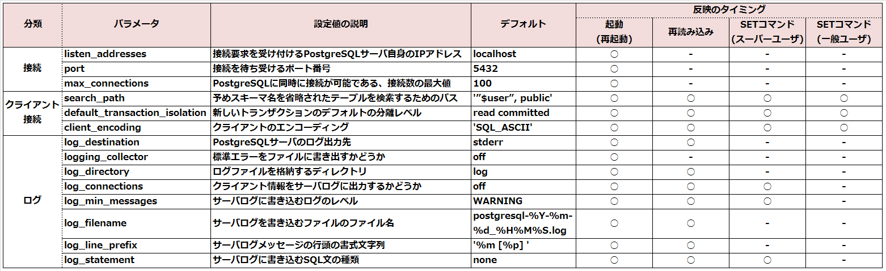

# Ping-T メモ

## SQL
### Foreign key
下記のどちらでもOK.

```sql
CREATE TABLE sample (
    no INTEGER REFERENCES sample_1 (id),
    name TEXT 
);
```

```sql
CREATE TABLE sample (
    no INTEGER,
    name TEXT,
    FOREIGN KEY (no) REFERENCES sample_1 (id)
);
```

### SQLの処理
下記のいずれも実行可能。
```bash
$ psql -c "SLECT * FROM sample"
testdb=> SELECT * FROM sample
$ psql testdb < sample.sql
$ psql -f 'sample.sql'
```

## 設定ファイル
### ログレベルの設定
|ログレベル|説明|
|---|---|
|INFO|ユーザから出力を要求された情報|
|NOTICE|ユーザにとって役立つ情報|
|WARNING|不適切なコマンド使用等に対するユーザへの警告|
|ERROR|特定のコマンドを中断させたエラー|
|LOG|データベース管理者にとって役立つ、パフォーマンスや内部の処理に関する情報|
|FATAL|特定のセッションを中断させたエラー|
|PANIC|全てのセッションを中断させた致命的なエラー|


## 標準ツールの使い方
### pg_restartwal
WALや制御情報の破損によりPostgreSQLサーバが起動できない場合は、pg_restartwalコマンドを実行することで
復旧できる可能性がある。
コマンドの実行後はデータに不整合が発生している可能性がある。

|コマンド|説明|
|---|---|
|-d, --pgdata|対象となるデータベースクラスタを指定する|
|-n, --dry-run|実際に変更処理は行わず、変更内容の出力のみを行う|
|-f, --force|制御情報が読み取れない場合でも、強制的に実行する|

### createuser
|オプション|説明|
|---|---|
|-P, --pwprompt|パスワードを設定する|
|-s, --superuser|新しいユーザをスーパーユーザとして作成する|
|-d, --createdb|データベースの作成を許可する|
|-r, --createrole|新しいユーザの作成を許可する|
|-l, --login|ログインを許可する|


### dropuser
アカウントを削除する。  
-Uを指定すると、接続時のデータベースユーザーを指定することができる。

### createdb
- テンプレートデータベースから設定やオブジェクトをコピーして作成する。
- テンプレートにtemplate0を使用し、template0と別のエンコーディングを設定して新規にデータベースを作成できる。
- テンプレートデータベースを指定するオプションは、-Tまたは--templateである。

|オプション|説明|
|---|---|
|-E, --encoding=エンコーディング|データベース内で使用するエンコーディングを指定する|
|-O, --owner=ユーザ名|新しいデータベースの所有者となるユーザを指定する|
|-l, --locale=ロケール名|データベースで使用されるロケールを指定する|
|-T, --template=テンプレート名|テンプレートデータベースを指定する|

### pg_restore
論理バックアップのリストアに使用するコマンドで、テキスト以外(カスタム形式やtar形式)でバックアップされたファイルが対象となる。

|オプション|説明|
|---|---|
|-d, --dbname=データベース名|リストアを行う先のデータベース名を指定する。省略すると標準出力にテキスト形式のSQL分が出力される|
|-c, --clean|リストア前に既存のデータベースオブジェクトを削除する|
|-j, --jobs=ジョブ数|リストア処理を同時に実行するジョブ数を指定する|
|-1, --single-transaction|リストア処理を1つのトランザクションとして実行する|


### psqlの接続オプション
|接続オプション|説明|環境変数|デフォルト|
|---|---|---|---|
|-U ユーザ名|接続時のデータベースユーザ名を指定|PGUSER|OSユーザ名|
|-h ホスト名またはIPアドレス|接続先のホスト名またはIPアドレスを指定|PGHOST|UNIXドメインによる接続|
|-d データベース名|接続先のデータベース名を指定|PGDATABASE|データベースユーザ名|
|-p ポート名|接続先のポート番号を指定|PGPORT|5432|

### pg_ctl stop
|オプション|説明|
|---|---|
|-D データベースクラスタ名, --pgdata=データベースクラスタ名|対象となるデータベースクラスタを指定する。指定がない場合は、環境変数「$PGDATA」になる|
|-m シャットダウンモード|3つの異なるシャットダウン方式を指定する|
|-W|シャットダウンの完了を待たずにコマンド発行元に制御を戻す(デフォルトでは完了まで最大60秒待ち、停止完了のメッセージを表示する)|
|-t 最大待ち時間|シャットダウンが完了するまでの待ち時間を指定する 指定がない場合は60秒になる|


### createdb
指定しない場合は、template1が適用される。  
template0は設定の変更が可能。


## SQL

### シーケンス

シーケンスのセット  

```sql
# SELECT setval('sample', 100);
```

### 配列型
配列型は複数の値を格納するデータ型であり、全データ型に対して使用できる。  
最初の要素のインデックスは`1`なので注意が必要。


### search_path

search_pathのデフォルトは、`$user, public`  
実行にスーパユーザ権限は必要ない。


### TRIGGER
挿入、更新、削除が要求された場合、各処理の前に一度だけ「log_write()」
関数を実行する。

```sql
# CREATE TRIGGER sample_trg BEFORE INSERT OR UPDATE OR DELETE
  ON sample EXECUTE PROCEDURE log_write();
```

トリガー名を変更する
```sql
# ALTER TRIGGER sample_trg ON sample RENAME TO log_trg;
```


### NATURAL INNER JOIN
等しい名称のカラムを用いて、結合を行う。
```sql
# SELECT * FROM member NATURAL INNER JOIN department;
```


### パーティショニング
テーブルなどのデータを複数のまとまりに分割する機能。
データへの処理パフォーマンスを向上させることができる。

パーティションの作成には、
```sql
# CREATE TABLE PARTITION ...
```

パーティションの削除は、
```sql
# DROP TABLE ...
```

### MATERIALIZED VIEW
複雑なSQL文のSELECT結果を頻繁に取得する場合に使用する機能。
データの実体を保持する。

定義を変更する場合は、`ALTER MATERIALIZED VIEW`  
ビューの更新は、`REFRESH MATERIALIZED VIEW`  

### sequence
下記のコマンドでは、1010が返される。

```sql
# CREATE SEQUENCE sample_sql CACHE 5 NO CYCLE;
# SELECT setval('sample_seq');
```

### interval
現在の3ヶ月前の日時を取得する。
```sql
# SELECT now() - interval '3 month';
# SELECT now() p '3 month'::interval;
```

### FUNCTION
FUNCTIONの作成。  
STRICTオプションを指定すると、
NULLを渡すと処理を実行せずにNULLを返す。

```sql
# CREATE FUNCTION sample_func(TEXT) RETURNS SETOF INTEGER AS $$
  SELECT id FROM sample staff = $1 ORDER BY id LIMIT 2;
  $$ LANGUAGE SQL STRICT;
```

FUNCTIONの削除。
```sql
# DROP FUNCTION sample(TEXT);
```

### CREATE PROCEDURE
version11から使用できる。  
CREATE FUNCTIONのうち、戻り値のないものに対して代用できる。

```sql
# CREATE PROCEDURE funcX(VARCHAR) AS $$
  INSERT INTO suctomer_log VALUES($1, CURRENT_DATE, 'shopA');
  $$ LANGUAGE SQL;
```
PROCEDUREの呼び出しには、`CALL`を用いる。

### バイナリ列データ
バイトの連続からなるテキスト以外のデータ。バイナリ列データを格納するデータ型として、BYTEA型が用意されている。

### SCHEMA
多数のデータベースの格納先を、テーブルの目的や所有者に応じて分類する仕組みのこと。 実体としては、データベース内でテーブルなどのオブジェクトを格納している名前空間のことを指す。

- データベースクラスタの作成時にデフォルトでpublicスキーマが作成される。

```sql
# CREATE SCHEMA test AUTHORIZATION user1;
```

SCHEMAの削除
```sql
# DROP SCHEMA test;
```

SCHEMにオブジェクトが存在する場合、
```sql
# DROP SCHEMA test CASCADE;
```


### CURSOR
```sql
# DECLARE sample_cursor INSENSITIVE CURSOR WITHOUT HOLD FOR SELECT * FROM sample;
```

`WITHOUT HOLD`は、トランザクション内でのみカーソルを使用するオプション(デフォルト).

FETCH  
- データの取得をせずにカーソルの移動のみを行う場合には`MOVE`コマンドを使用する。
- `PRIOR`オプションを指定すると、前の行のデータを取得する。
- `ALL`オプションを指定すると、カーソルのある次の行以降の全データを取得する。

逆方法にデータを取得しようとした場合はエラーとなり、トランザクションの実行中のみ有効である。
```sql
# DECLARE sample_cursor NO SCROLL CURSOR FOR SELECT * FROM sample;
```


### ドメイン
ユーザが一部の制約を設定して作成出来るデータ型のこと。  
複数のテーブルに対して、同じ制約条件(NULL/NOT NULL/CHECK)を持つデータ型を使用したい場合に、独自のデータ型を定義できる。

- ドメインにはデフォルト値を設定できる。
- データベースないの複数のテーブルに使用できる。
- ドメイン定義の変更は、`ALTER DOMAIN`を使用する。


### 数値型

BIGINT  
64ビット(8バイト)

INT, INTEGER  
32ビット(4バイト)

DOUBLE PRECISION  
最低15桁の精度をもつ小数を格納する。


### 宣言パーティション
- ハッシュ・パーティション
- レンジ・パーティション
- リスト・パーティション


### PREPARED
プリペアド文の削除
```sql
# DEALLOCATE sample_prepare;
```

### テーブルスペース
- データベースオブジェクトの作成時に、格納するテーブルスペースを指定することができる
- データベースオブジェクトを各テーブルスペースに振り分けることで、性能を向上させることができる


### INDEX
インデックスの削除
```sql
# DROP INDEX member_idx;
```

### DISTINCT
```sql
# SELECT DISTINCT ON (groupNo) groupNo FROM sample WHERE sex = '男';
# SELECT DISTINCT groupNo FROM sample WHERE sex = '男';
```


### PITR
PITRは、
- 事前設定
- ベースバックアップ
- リカバリ
の順で使用する。

- ログファイルをアーカイブして保存する設定が必要
- リカバリ時に「recovery.signal」ファイルを作成する必要がある


### \copy
- クライアント側のファイルにアクセスするpsqlのメタコマンド。  
- delimiterオプションを指定することで区切り文字を変更できる。
- スーパユーザ権限は必要ない

### GRANT
GRANTコマンドで設定できる権限
- SELECT, COPY TO
- INSERT, COPY FROM
- UPDATE
- DELETE
- TRUNCATE
- REFERENCES
- TRIGGER
- CONNECT
- CREATE


### ANALYZE
sampleテーブルに対する統計情報を収集する
```sql
# ANALYZE sample;
```


### VIEW
VIEWでは
- SELECT
- UPDATE
- DELETE
- INSERT
を実行できる。


## 設定ファイル
### postgresql.conf
PostgreSQLのパラメータを設定するファイル。  

- 全てのパラメータ名は大文字と小文字の区別がない
- パラメータは1行に1つずつ
- 設定変更反映のタイミングは、パラメータによって異なる


initdbで生成される。  

下記が重要な設定項目

- listen_addresses
- port
- max_connections
- search_path
- default_transaction_isolation
- client_encoding
- log_distination
- logging_collector
- log_directory
- log_filename
- log_min_messages
- log_line_prefix
- 

#### 設定が反映されるタイミング


### postgresql.auto.conf
- postgresql.confの設定よりも優先される
- バージョン9.4で追加された機能
- ALTER SYSTEMコマンドで操作する

### pg_hba.conf
クライアント認証を設定するファイル。  
initdbで生成される。  

### pg_settings
pg_settingsは、サーバのパラメータ値を取得するビュー。
nameカラムにパラメータ名、settingカラムにパラメータ値が表示される。

- internal: データベースクラスタの構築後は変更できない
- postmaster: PostgreSQLサーバの起動・再起動
- sighup: postgresql.confの再読み込み
- superuser-backend: スーパユーザで新しいセッションを開始
- backend: 一般ユーザで新しいセッションを開始
- superuser: スーパユーザでSETコマンド実行
- user: 一般ユーザでSETコマンド実行

### ログメッセージ
- PANIC: 全てのセッションを中断させた致命的なエラー
- FATAL: 特定のセッションを中断させたエラーが発生
- ERROR: 特定のコマンドを中断させたエラーが発生
- WARNING: 不適切なコマンド使用等に対するユーザへの警告

### SET
SETで変更した設定は、postgresqlの再起動時に破棄される。


## バックアップとリストア

### 稼働中のバックアップ
```bash
$ pg_dump sampledb
```

### 停止中のバックアップ
```bash
$ cd $PGDATA/..
$ tar cvf backup.tar data
```

### PITR(Point In Time Recovery)

```bash
$ pg_basebackup
```

```postgres
# SELECT pg_start_backup('label', false, false);
```

### COPYと\copy
```postgres
-- テーブルをcsvでファイルに書き出し
# \copy users to 'data/users.txt' (format csv, header)
```

```postgres
-- テキストファイルから読み込み
# \copy users from 'data/users.txt' (format csv, header)
```

または、バッチ処理として、
```postgres
# COPY users(id,name,age) FROM 'users.txt' DELIMITER ',' CSV HEADER;
COPY 4
```
これの実行には、書き込み権限が必要。 


